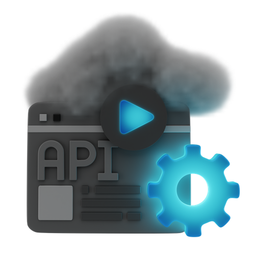

# Hi 👋! My name is Diego and I'm a Software Engineering Student from Colombia

  
  
  

## About Me
I'm a 5th semester Software Engineering student passionate about full-stack development. I enjoy building intuitive, responsive applications and am constantly expanding my technical skill set.

## 💻 Technologies & Tools

  
  
  
  
  
  
  
  
  
  
  
  
  
  
  
  
  

## 📊 GitHub Stats

  
  

## 🌱 Currently Learning

- Advanced Spring Boot concepts
- Microservices architecture  
- CI/CD pipelines
- Cloud deployment (AWS/Azure)

## 📫 Connect with me

  
  
  

 

  

